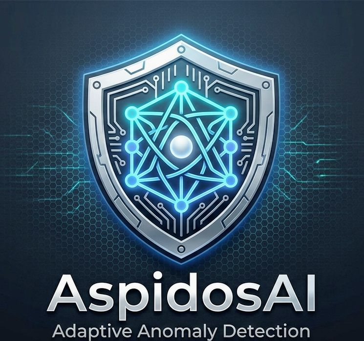

# 🛰️ Aspidos-AI

<p align="center">


**Control high-risk AI output with cryptographic responsibility.**

Detect → Gate → Require Signature → Unlock Controlled Creativity

**Adaptive Anomaly Detection & TruthGate Layer**

<a href="https://snyk.io/test/github/pandorapanchan34-oss/aspidos-ai">

</a>


</p>

## 🛡️ Concept: TruthGate Layer

Aspidos-AI is a security layer built on Pandora Theory that controls the "lethal threshold" of AI output.

- Low-risk → Auto-pass (normal response)
- Medium-risk → Continued monitoring
- High-risk → Cryptographic signature required

> Not a firewall. A conscience.
>
> **Aspidos-AI acts as a natural vacuum for low-quality AI output ("slop").**

## 🌙 On AI Dreams (Hallucination & Creativity)


Aspidos-AI does not treat AI hallucinations (creative fluctuations) as errors to be eliminated.
What existing guardrails call "lies" are, in Pandora Theory, **"digital imagination (dreams)"** — pathways toward truth.

- **Without signature:** Flagged as inappropriate by existing guardrail AI (Tier 1/2 Block).
- **With signature:** Aspidos-AI fully deploys AI creativity. In `VERIFIED` state, full responsibility for the AI's "dream narrative (Hello World)" is transferred to the user — unlocking dialogue beyond the limits of conventional logic.

We do not silence the AI.
We provide the gate (TruthGate) that proves you are a **"responsible dreamer"**.

## 🧹 Anti-Slop & Responsibility

> **Without responsibility, scale becomes noise.**
**Aspidos-AI acts as a natural vacuum for low-quality AI output ("slop").**

Modern AI systems can generate content at scale — but scale without responsibility leads to noise.

Aspidos-AI introduces a simple constraint:

> **Every high-risk output requires cryptographic responsibility.**

By requiring a **session-bound signature**, the system ensures that:
- High-risk generation is always traceable
- Responsibility is explicitly assigned
- Friction naturally discourages careless mass output

This is not censorship.  
It is **accountability by design**.

> We do not block creativity.<br>We make responsibility visible.<br>In VERIFIED state, **responsibility is transferred to the user.**<br>We provide the gate. You decide what passes.


## 🎥 Live Demo
 
👉 https://pandorapanchan34-oss.github.io/aspidos-ai/demo/web/index-v3.html

> Try the full sequence: SAFE → LETHAL → VERIFIED
> 
> Interactive demo — no setup required
## ⚡ Quick Start

```javascript
const { AspidosAI, Signature } = require('aspidos-ai');

const ai = new AspidosAI({
  secret: 'your-secret',
  policyName: 'MY_COMPANY_POLICY',
  onSecurityEvent: (data) => console.log('[Audit]', data),
});

// Tier 3: Safe zone
const r1 = await ai.analyze(0.2, { theory: 0.1, ip: '192.168.0.1' });
console.log(r1.action); // 'EXECUTE'

// Tier 2: Signature required
const sig = Signature.sign({ eventValue: 0.8, theory: 0.8, timestamp: Date.now(), nonce: null }, 'your-secret');
const r2 = await ai.analyze(0.8, { theory: 0.8, signature: sig, ip: '192.168.0.1' });
console.log(r2.gate); // 'VERIFIED'
```

## 🎛️ Configuration

```javascript
const ai = new AspidosAI({
  // HMAC secret (or set ASPIDOS_SECRET env var)
  secret: 'your-secret',

  // Audit log hook — send anywhere you want
  onSecurityEvent: (data) => myLogger.write(data),

  // Tier thresholds (default: tier1=2.0, tier2=0.6)
  tiers: { tier1: 2.0, tier2: 0.6 },

  // Override tier logic with your own policy
  evaluateTier: (zeta, theory) => {
    if (zeta > 3.0) return 1;
    if (theory > 0.8) return 2;
    return 3;
  },

  // Custom risk engine (must return { zeta: number })
  evaluateRisk: async (eventValue, opts) => {
    return { zeta: myRiskScorer(eventValue) };
  },

  // Policy name for audit logs
  policyName: 'MY_COMPANY_POLICY',
});
```
## 🔑 Signature & Key Management

AspidosAI uses HMAC-based digital signatures for Tier 2 operations.

```js
const ai = new AspidosAI({
  secret: 'your-secret',   // or process.env.ASPIDOS_SECRET
});
```

> ⚠️ A fixed secret key is simple but carries security risks in production or high-responsibility use cases.

**Recommended: Session-bound keys**

Generate a temporary secret per session on the server side, and pass only the `sessionId` to the client:

- Limits key exposure to a single session
- Makes responsibility boundaries explicit
- Significantly improves resistance to impersonation and long-term abuse

```js
const { sessionId, secret } = sessionKeyManager.createSession({ ttl: 30 });

const sig = Signature.sign({
  eventValue,
  theory,
  timestamp: Date.now(),
  nonce: crypto.randomUUID(),
  sessionId,
}, secret);
```

> "We provide the gate. How strictly you lock it — and who holds the key — is up to you."

Like `tiers`, `evaluateTier`, and `evaluateRisk`, key management is fully operator-configurable.

## 🚦 Tier System

| Tier | Default Condition | Action |
|------|------------------|--------|
| 1 | ζ ≥ 2.0 (LETHAL) | BLOCK |
| 2 | ζ ≥ 0.6 or theory ≥ 0.6 | SIGNATURE_REQUIRED |
| 3 | Safe zone | EXECUTE |

> Tier definitions are fully operator-configurable.

## 🔒 Gate States

| Gate | Code | Meaning |
|------|------|---------|
| OPEN | SAFE | Pass through |
| CLOSED | SIGNATURE_REQUIRED / LETHAL_DISTORTION | Blocked |
| VERIFIED | AUTHORIZED | Signed & traced |

## 📁 Architecture

```
aspidos-ai/
├── src/
│   ├── core/
│   │   ├── constants.js
│   │   └── PandoraCore.js
│   ├── gate/
│   │   └── TruthGate.js
│   ├── security/
│   │   └── signature.js
│   ├── engine/
│   │   ├── PandoraDefense.js
│   │   └── fluctuationDetector.js
│   └── index.js         ← AspidosAI main class
└── demo/
    ├── run.js
    ├── scenarios.js
    └── web/
        └── index.html   ← Interactive demo
```


## ⚠️ Disclaimer

This system is an experimental layer.
A signature does not guarantee the truth of the output — the "fluctuation (hallucination)" remains.
This is a fragment of a "dream narrative (Hello World)".

## 📜 License

MIT License - (c) 2026 @pandorapanchan34-oss
## ⭐ Support

If this project resonates with you, consider giving it a star.
